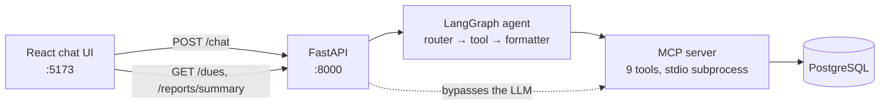

# TrueProfit AI Agent

TrueProfit AI Agent is a conversational accounting and working-capital management system for retail businesses. It captures revenue and operating expenditure from plain-language input, posting each entry to the appropriate account — cash and digital sales to revenue, purchases to categorized expense heads (inventory, rent, utilities, payroll, transport). It maintains records for both sides of trade credit: accounts payable to vendors, with due dates and reminders, and accounts receivable from customers, automatically settling open receivables against incoming repayments in a single atomic transaction. For reporting, it generates period profit-and-loss statements — revenue, expenses, broken down by category — alongside outstanding payable and receivable positions and period-over-period variance analysis for flagging cost anomalies such as an unusually high utility bill.

Built as a **LangGraph agent over a custom MCP server**, so all database access
lives behind a clean tool layer that any MCP client could reuse.

```
┌──────────────────────────────────────────────────────────────┐
│  You: paid 2000 rent, cash                                   │
│  Agent: Logged: Rs 2000 rent, cash.                          │
│                                                              │
│  You: I owe Sharma Traders 2000                              │
│  Agent: When is that due?                                    │
│  You: next Friday                                            │
│  Agent: Logged: Rs 2000 payable to Sharma Traders, due Aug 1.│
└──────────────────────────────────────────────────────────────┘
```

---

## What it handles

| You say | What happens |
|---|---|
| "sold 2 packets of biscuits for 40" | Income row, `cash_sale`, defaults to cash + today |
| "paid 2000 rent, cash" | Expense row, category `rent` |
| "I owe Sharma Traders 2000, due next week" | Vendor payable + auto-creates the vendor |
| "Ramesh took goods worth 300 on credit" | Customer credit row |
| "Ramesh paid back the 300 he owed" | Income row **and** settles his open credit, in one transaction |
| "how much do I have to pay?" | Lists outstanding vendor payables |
| "who owes me money?" | Lists outstanding customer credit |
| "what was my profit last week?" | Resolves the date range, returns income − expenses |
| "is my electricity bill higher than usual?" | Compares the period against the preceding one |

A sidebar shows live **Dues** and **Reports** tabs, plus a banner for vendor
payments coming due.

## How it works



Three design decisions worth knowing about:

**The MCP tool layer is the only thing that touches SQL.** The agent never
writes queries — it calls tools like `log_expense` and `get_profit_summary`. That
keeps reasoning and data access independently testable, and the tool layer is a
real MCP server you can point any MCP client at.

**Dashboard reads skip the LLM entirely.** `GET /dues` and `GET /reports/summary`
call the MCP tools directly. No token cost or latency for a panel refresh, and
the numbers are deterministic.

**Clarification is a graph node, not a retry.** If you say "I owe Sharma Traders
2000" without a due date, the router marks the field missing and routes to a
clarify node instead of guessing or writing a half-row. Your answer arrives on
the next turn with the conversation still in context (LangGraph checkpointer,
keyed by `session_id`), so it lands as **one** complete record.

## Quick start

Requires Docker and an [OpenAI API key](https://platform.openai.com/api-keys).

```bash
cp .env.example .env     # then put your OPENAI_API_KEY in it
docker compose up --build
```

Open **http://localhost:5173**. That's it — Postgres, backend, MCP server, and
frontend all come up together, and the schema plus seed data is applied on first
run.

To stop: `docker compose down` (add `-v` to also wipe the database).

## Local development

Useful if you want hot reload instead of rebuilding images. Requires Python 3.12+
and Node 18+.

<details>
<summary>Step-by-step setup</summary>

**1. Postgres**

```bash
docker compose up -d postgres
```

**2. Backend** (this also spawns the MCP server as a subprocess — you don't start
it separately)

```bash
cd backend
python3 -m venv .venv && source .venv/bin/activate
pip install -r requirements.txt
cp .env.example .env      # set OPENAI_API_KEY
uvicorn app.main:app --reload --port 8000
```

**3. Frontend**

```bash
cd frontend
npm install
cp .env.example .env
npm run dev
```

**Optional — run the MCP server standalone** to poke at the tools without the
agent in the way:

```bash
cd mcp_server
python3 -m venv .venv && source .venv/bin/activate
pip install -r requirements.txt
cp .env.example .env
npx @modelcontextprotocol/inspector python server.py
```

</details>

## Project structure

```
backend/
  app/
    agent/graph.py       LangGraph: intent router, tool nodes, clarify, formatter
    agent/mcp_tools.py   spawns + talks to the MCP server over stdio
    api/                 /chat, /dues, /reports/summary, /reminders
    db/models.py         SQLAlchemy models
    reminders.py         APScheduler job for upcoming vendor dues
mcp_server/
  server.py              registers the 9 tools with FastMCP
  tools/                 expenses, income, credit, reports
  validation.py          amount/date/category sanitizing, before anything hits SQL
frontend/src/
  components/            ChatWindow, MessageBubble, DuesPanel, ReportsView
db/init.sql              schema + seed, auto-applied by the Postgres container
```

## HTTP API

| Endpoint | Purpose |
|---|---|
| `POST /chat` | `{session_id, message}` → `{reply, actions_taken?}` — runs the agent |
| `GET /dues?type=vendor\|customer` | Outstanding payables or receivables |
| `GET /reports/summary?start_date=&end_date=` | Income, expenses, profit, by category |
| `GET /reminders` | Vendor payments due within the lookahead window |
| `GET /health` | Liveness check |

Interactive docs at `http://localhost:8000/docs`.

## MCP tools

`log_expense` · `log_income` · `log_credit_repayment` · `add_vendor_credit` ·
`add_customer_credit` · `list_pending_dues` · `get_expense_summary` ·
`get_income_summary` · `get_profit_summary`

Each validates its own input — amounts must be positive and sane, dates must be
`YYYY-MM-DD`, categories and payment methods are checked against allowed sets —
so a hallucinated argument fails at the tool boundary rather than reaching SQL.

## Configuration

| Variable | Used by | Default |
|---|---|---|
| `OPENAI_API_KEY` | backend | *(required)* |
| `AGENT_MODEL` | backend | `gpt-4o` |
| `DATABASE_URL` | backend, mcp_server | local Postgres |
| `CORS_ORIGINS` | backend | `http://localhost:5173` |
| `DEFAULT_SHOP_ID` | backend, mcp_server | `1` |
| `REMINDER_LOOKAHEAD_DAYS` | backend | `3` |
| `REMINDER_CHECK_INTERVAL_HOURS` | backend | `24` |
| `VITE_API_BASE_URL` | frontend | `http://localhost:8000` |

For Docker, only `OPENAI_API_KEY` in the root `.env` is needed — the rest is set
in `docker-compose.yml`. The `.env.example` files in each service directory cover
the local-development case.

## Tests

```bash
cd mcp_server && source .venv/bin/activate && pytest   # 35 tests
cd backend    && source .venv/bin/activate && pytest   # 20 tests
```

The MCP suite runs against a real Postgres (start it with
`docker compose up -d postgres`; it skips cleanly if unreachable) and covers each
tool's happy path, rejected input, credit settlement, and concurrent writes. The
backend suite stubs the tool layer to assert the agent routes each intent to the
right tool with the right arguments — no API key or database needed, so it runs
in plain CI.

## Scope and limitations

- **Single shop.** `shop_id` is fixed at `1`; there's no auth or multi-tenancy.
- **Conversation memory is in-process.** LangGraph uses `MemorySaver`, so chat
  context resets when the backend restarts. Your financial data is unaffected —
  that's in Postgres. Swap in `AsyncPostgresSaver` if you need durable threads.
- **Dev servers, not production.** Both containers run dev servers with permissive
  CORS. Add a production frontend build, real secrets handling, and a WSGI/ASGI
  process manager before deploying anywhere public.
- **No retrieval layer yet.** Free-text search over past descriptions (pgvector
  over `description` / `item_description`) is a natural next step once there's
  enough history to make it useful.
